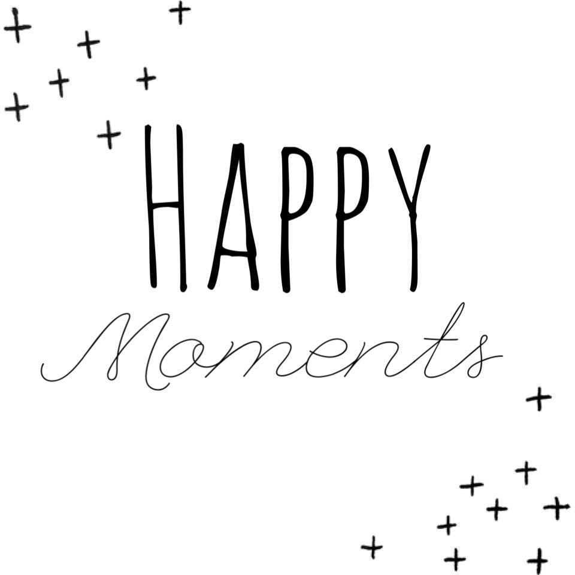

<center>

</center>

HappyDB is a corpus of more than 100,000 happy moments crowd-sourced via Amazon’s Mechanical Turk.

Each worker is given the following task: What made you happy today? Reflect on the past 24 hours, and recall three actual events that happened to you that made you happy. Write down your happy moment in a complete sentence. (Write three such moments.)

The goal of the corpus is to advance the understanding of the causes of happiness through text-based reflection. (https://www.kaggle.com/ritresearch/happydb/home)

In this study, our goal is to find some interesting or significant results from the HappyDB datebase with different tools. We will use different useful packages and algorithms to reveal information hidden behind words and numbers, and we will also try to train some classifiers that can make successful prediction.

##PART I: Sentence Analysis

###Load all the required libraries
```{r load libraries, warning=FALSE, message=FALSE}
#install.packages("tidyverse")
library(tidyverse)
#install.packages("tidytext")
library(tidytext)
#install.packages("DT")
library(DT)
#install.packages("scales")
library(scales)
#install.packages("wordcloud2")
library(wordcloud2)
#install.packages("gridExtra")
library(gridExtra)
#install.packages("ngram")
library(ngram)
#install.packages("tm")
library(tm)
#install.packages("NLP")
library(NLP)
#install.packages("ggplot2")
library(ggplot2)

theme_update(plot.title = element_text(hjust = 0.5)) # Center-align ggplot title
```

###Load the processed text data along with demographic information on contributors

We use the processed data for our analysis and combine it with the demographic information available.

```{r load data, warning=FALSE, message=FALSE}
hm_data <- read_csv("../output/processed_moments.csv")

urlfile<-'https://raw.githubusercontent.com/rit-public/HappyDB/master/happydb/data/demographic.csv'
demo_data <- read_csv(urlfile)
```

### Combine both the data sets and keep the required columns for analysis

We select a subset of the data that satisfies specific row conditions.

```{r combining data, warning=FALSE, message=FALSE}
hm_data <- hm_data %>%
  inner_join(demo_data, by = "wid") %>%
  select(wid,
         original_hm,
         gender, 
         marital, 
         parenthood,
         reflection_period,
         age, 
         country, 
         ground_truth_category, 
         text) %>%
  mutate(count = sapply(hm_data$text, wordcount)) %>%
  filter(gender %in% c("m", "f")) %>%
  filter(marital %in% c("single", "married")) %>%
  filter(parenthood %in% c("n", "y")) %>%
  filter(reflection_period %in% c("24h", "3m")) %>%
  mutate(reflection_period = fct_recode(reflection_period, 
                                        months_3 = "3m", hours_24 = "24h"))
```

###What do the original answers look like, are they short or long?
```{r, fig.align='center', warning=FALSE}
# Count number of words(length of sentense) for all
count <- sapply(hm_data$original_hm, wordcount)
summary(count)
#png(filename="../figs/bar.png")
barplot(table(count),xaxt='n',main = "Word Count")
# Count words for males
count_m <- sapply(subset(hm_data, gender=="m")$original_hm, wordcount)
summary(count_m)
# Count words for females
count_f <- sapply(subset(hm_data, gender=="f")$original_hm, wordcount)
summary(count_f)
```
From the analysis above we can see that, before cleaning, the longest answers includes 1155 words and the shortest one just has 2 words, happiness is sometimes quite complicated and sometimes quite simple, isn't it? The mean and median of the length of the answers are 6 and 5 words respectively, which means most of the happy moment can be described with a couple of words.

The comparison between males and females also shows that females tend to write more when responding a question.

To take a closer look at the distribution of word count, it is better to group the counts.
```{r,fig.align='center'}
word_count_range <- c("0-9","10-19","20-29","30-39","40-49",">=50")
word_count_class <- cut(count, breaks = c(0,9,19,29,39,49,Inf), 
                        labels = word_count_range, include.lowest = TRUE)

ggplot()+
  geom_bar(aes(x = word_count_class, fill = word_count_class))+
  ylim(0,45000)+
  labs(x = "Word Count", y = "Frequency", title = "Word Count Distribution")+
  guides(fill = "none")+scale_fill_brewer()
```

It is clear that most people answer this question with 10 to 20 words, just as we expected. 20 words seems enough to decribe when, where and how we can feel happy.

###What are the words that people use the most when describing their happy moment? Let's take a look at the Word Frequency using cleaned answers.

```{r, warning=FALSE,message=FALSE}
#create TermDocument Matrix
corpus <- Corpus(VectorSource(hm_data$text))
#removing noise words
skipWords <- function(x) removeWords(x, words = c(stopwords(kind = "en"),
                'happy', 'the', 'day', 'got', 'went', 'watched', 'today', 'made', 'one', 'two',
                'time', 'last', 'first', 'going', 'getting', 'took', 'found', 'lot',
                'really', 'saw', 'see', 'month', 'week', 'day', 'yesterday', 'year',
                'ago', 'now', 'still', 'since', 'something', 'great', 'good', 'long',
                'thing', 'today', 'without', 'yesterday','feel','played','finally',
                'enjoyed','moment'))
funcs     <- list(skipWords, stripWhitespace, removeNumbers, removePunctuation, tolower)
new_a         <- tm_map(corpus, FUN = tm_reduce, tmFuns = funcs)
new_a_tdm     <- TermDocumentMatrix(new_a)
new_m         <- as.matrix(new_a_tdm)
new_v         <- sort(rowSums(new_m), decreasing = TRUE)
new_d         <- data.frame(word = names(new_v), freq = new_v)
head(new_d,10)
```
The word with highest frequency is friend, that makes sense! The top ten words are either important part of our life like "family" and "home", or specific things like "dinner", "game" and "job", This result is quite reasonable.

```{r,fig.align='center'}
#pie chart
top_word <- new_d[1:10,]
chart <- ggplot(top_word, aes(x=word, y=freq, fill=word))+
geom_bar(width = 1, stat = "identity")
pie_chart <- chart+coord_polar(start=0)+
  labs(x = "Word", y = "Frequency", title = "Word Distribution")
pie_chart
```

The pie chart gives us a more straightforward way to view the results.

```{r,fig.align='center'}
#Word Cloud
library("SnowballC")
library("wordcloud")
library("RColorBrewer")
library(wordcloud)
set.seed(0)
word_cloud <- new_d[1:200,]
wordcloud(words = word_cloud$word, freq = word_cloud$freq, min.freq = 1,
          max.words=200, random.order=FALSE, rot.per=0.35, 
          colors=brewer.pal(8, "Dark2"))
```

Word Cloud is another way to give a straightforward view of the word count.

It seems that people's definition of happiness changes with age, then what are the most popular words of people with different ages?
```{r,warning=FALSE,fig.align='center'}
age_data <- hm_data[c("text", "age")]
#visualization of distribution of age
barplot(table(age_data$age))
#divide people into 3 age groups: under 20, 20 to 40, 40 and older.
age_data$age2 <- floor(as.integer(age_data$age)/10)
#only consider age under 100
age <- age_data[age_data$age2<10,"age2"]
barplot(table(age))
young <- age_data[age_data$age<20,]
middle <- age_data[age_data$age<40&&age_data$age>20,]
old <-age_data[age_data$age>40,]
```
The bar plot above shows that most of the responsors are in their 20s or 30s, so our previous analysis might be bias to some extend and somehow ignored the young and old generation.

###Then what would the young generation's word cloud look like?
```{r,warning=FALSE,fig.align='center'}
#create TermDocument Matrix
corpus <- Corpus(VectorSource(young$text))
#removing noise words
skipWords <- function(x) removeWords(x, words = c(stopwords(kind = "en"),
                'happy', 'the', 'day', 'got', 'went', 'watched', 'today', 'made', 'one', 'two',
                'time', 'last', 'first', 'going', 'getting', 'took', 'found', 'lot',
                'really', 'saw', 'see', 'month', 'week', 'day', 'yesterday', 'year',
                'ago', 'now', 'still', 'since', 'something', 'great', 'good', 'long',
                'thing', 'today', 'without', 'yesterday','feel','played','finally',
                'enjoyed','moment'))
funcs     <- list(skipWords, stripWhitespace, removeNumbers, removePunctuation, tolower)
new_a         <- tm_map(corpus, FUN = tm_reduce, tmFuns = funcs)
new_a_tdm     <- TermDocumentMatrix(new_a)
new_m         <- as.matrix(new_a_tdm)
new_v         <- sort(rowSums(new_m), decreasing = TRUE)
new_d         <- data.frame(word = names(new_v), freq = new_v)
head(new_d,10)

#Word Cloud
set.seed(0)
word_cloud <- new_d[1:200,]
wordcloud(words = word_cloud$word, freq = word_cloud$freq, min.freq = 1,
          max.words=200, random.order=FALSE, rot.per=0.35, 
          colors=brewer.pal(8, "Dark2"))
```

"Friend" is still the word of highest frequency, and different from our previous analysis, "game" and "event" take the second and third places in young generation's dictionary of happiness; "College", "school" and "class" also stand out since they are the places where young people stay; It seems that "Girlfriend" and "boyfriend" are as important as "family" for the young generation. 

Compared to the general word cloud for all, young people focus more on their school work and school life, this result is consistent with our forecast.

###At last, let's take a look at the older generation.
```{r,warning=FALSE,fig.align='center'}
#create TermDocument Matrix
corpus <- Corpus(VectorSource(old$text))
#removing noise words
skipWords <- function(x) removeWords(x, words = c(stopwords(kind = "en"),
                'happy', 'the', 'day', 'got', 'went', 'watched', 'today', 'made', 'one', 'two',
                'time', 'last', 'first', 'going', 'getting', 'took', 'found', 'lot',
                'really', 'saw', 'see', 'month', 'week', 'day', 'yesterday', 'year',
                'ago', 'now', 'still', 'since', 'something', 'great', 'good', 'long',
                'thing', 'today', 'without', 'yesterday','feel','played','finally',
                'enjoyed','moment'))
funcs     <- list(skipWords, stripWhitespace, removeNumbers, removePunctuation, tolower)
new_a         <- tm_map(corpus, FUN = tm_reduce, tmFuns = funcs)
new_a_tdm     <- TermDocumentMatrix(new_a)
new_m         <- as.matrix(new_a_tdm)
new_v         <- sort(rowSums(new_m), decreasing = TRUE)
new_d         <- data.frame(word = names(new_v), freq = new_v)
head(new_d,10)

#Word Cloud
set.seed(0)
word_cloud <- new_d[1:200,]
wordcloud(words = word_cloud$word, freq = word_cloud$freq, min.freq = 1,
          max.words=200, random.order=FALSE, rot.per=0.35, 
          colors=brewer.pal(8, "Dark2"))
```

"Friend" wins again, "husband", "wife", "son", "daughter", "kids" are the most significant source of happiness for the old people. 


To sum up, the result is not surprising but still shocks me a lot. The young generation focuses more on their own, they can gain happiness easily from material comforts or achievement in school work; the middle-aged generation focuses more on their families and family life related stuff; most of the old people's happiness comes from their partners and children, they enjoy companion rather than material comforts.


###To many of us, pets are the source of happiness, but which kink of pets brings people more happiness, Dog or Cat？
```{r,fig.align='center'}
dog <- sum(new_d[new_d$word=="dog"|new_d$word=="dogs"|new_d$word=="puppy"|new_d$word=="puppies",2])
cat <- sum(new_d[new_d$word=="cat"|new_d$word=="cats"|new_d$word=="kitty"|new_d$word=="kitties",2])
pet.name <- c("dog","cat")
pet.count <- c(dog,cat)
pets <- data.frame(c("dog","cat"),c(dog,cat))
ggplot(pets, aes(pet.name, pet.count, fill = pet.name)) +
  geom_col()+
  labs(x = "Pet", y = "Frequency", title = "Pet Count Distribution")
```
Unsurprisingly, dogs won! Compared to cats' elegence, dogs are always passionate!

###Then which sport is the most popular?
```{r,fig.align='center'}
football <- sum(new_d[new_d$word=="football",2])
basketball <- sum(new_d[new_d$word=="basketball",2])
baseball <- sum(new_d[new_d$word=="baseball",2])
soccer <- sum(new_d[new_d$word=="soccer",2])
volleyball <- sum(new_d[new_d$word=="volleyball",2])
hockey <- sum(new_d[new_d$word=="hockey",2])
tennis <- sum(new_d[new_d$word=="tennis",2])
swimming <- sum(new_d[new_d$word=="swimming"|new_d$word=="swim",2])
skiing <- sum(new_d[new_d$word=="ski"|new_d$word=="skiing",2])

sports.count <- c(football,basketball,baseball,soccer,volleyball,hockey,tennis,
                  swimming,skiing)
sports.category <- c("football","basketball","baseball","soccer","volleyball","hockey",
                     "tennis","swimming","skiing")
sports <- data.frame(sports.category,sports.count)

ggplot(sports, aes(sports.category, sports.count, fill = sports.category)) + 
  geom_col() + 
  labs(x = "Sports", y = "Frequency", title = "Sports Count Distribution")
```
As we expected, baseball and basketball are the most popular sports, soccer and swimming also bring us lots of happiness!

##PART II: Regression classifier for marriage status

It is interesting that whether people with different marriage status would have different definition of happiness? And whether we can tell a person's marriage status by his/her decripiton of his/her happy moment?

A regression classifier may give us the answer.
```{r,fig.align='center'}
marital_data <- hm_data[c("text", "marital")]
#visualization of distribution of marriage status
barplot(table(marital_data$marital))
```

We will use only 15000 rows of data to accelerate the training process and split data into training set and test set

```{r}
# Convert representation of married and single to numerical value for classification
marital_bin_data <- marital_data
marital_bin_data$marital_bin <- ifelse(marital_bin_data$marital == "married", 1, 0)
# First 70% as training data, rest 30% as test data. 
# Using the only 15000 rows
set.seed(0)
marital_bin_data <- marital_bin_data[sample(1:nrow(marital_bin_data), 15000), ]

train_hm <- marital_bin_data[1:(0.7*nrow(marital_bin_data)), ]
test_hm <- marital_bin_data[((0.7*nrow(marital_bin_data))+1):nrow(marital_bin_data), ]
```

###Clean the text, remove spaces and other irrelative elements
```{r}
# Text cleaning function
funcs     <- function(x){
    x <- tolower(x)
    x <- sapply(x, gsub, patt = ",", replace = " ")
    x <- removePunctuation(x)
    x <- removeNumbers(x)
    x <- stripWhitespace(x)
    x <- removeWords(x, words = c(stopwords(kind = "en")))
    return(x)
}

clean_up_texts <- function(data){
  prepro_hm <- sapply(data$text, FUN = funcs)
  return(prepro_hm)
}
```
###Apply cleanning function to training and test data
```{r}
library(NLP)
# Cleaned happy moments in training data
prepro_train <- clean_up_texts(train_hm)
for(i in 1:nrow(train_hm)){
  train_hm$prepro[i] <- prepro_train[[i]]
}
# Cleaned happy moments in test data
prepro_test <- clean_up_texts(test_hm)
for(i in 1:nrow(test_hm)){
  test_hm$prepro[i] <- prepro_test[[i]]
}
```
After text cleaning, the training and test data are ready to use for classifier training

###Create document term matrix
```{r, warning==FALSE,message=FALSE}
# Another way of creating a DocumentTerm Matrix
library(text2vec)
library(data.table)
library(magrittr)

prep_fun <- tolower
tok_fun <- word_tokenizer

it_train <- itoken(train_hm$prepro,
                   preprocessor = prep_fun,
                   tokenizer = tok_fun,
                   progressbar = FALSE)
vocab <- create_vocabulary(it_train)
vectorizer <- vocab_vectorizer(vocab)
dtm_train <- create_dtm(it_train, vectorizer)

dim(dtm_train)
dim(train_hm)
```
###logistic regression
Fit the classifier using logistic regression with nfolds = 5 cross validation
```{r, warning=FALSE, message=FALSE,fig.align='center'}
library(glmnet)
# Fitting the classifier using logistic regression

lg_classifier <- cv.glmnet(x = dtm_train, y = as.factor(train_hm[["marital_bin"]]),
                     family = 'binomial', alpha = 1, type.measure = "auc",
                     nfolds = 5, thresh = 1e-3, maxit = 1e3)

plot(lg_classifier)
print (paste("max AUC = ", round(max(lg_classifier$cvm), 4)))

# Creating DocumentTerm Matrix for the test data
it_test <- test_hm$prepro %>%
  prep_fun %>%
  tok_fun %>%
  itoken(progressbar = FALSE)
dtm_test <- create_dtm(it_test, vectorizer)

# Evaluating the performance of our classifier on test data
preds = predict(lg_classifier, dtm_test, type = 'response')[,1]
glmnet:::auc(test_hm[["marital_bin"]], preds)
```
The result of logistic regression is pretty good, about 70% of the test data can be classified correctly. Considering of the size of our data and the diversity of people's choice of words, this is a very good classifier!


##Conclusion
R is not a perfect tool to do regression on big data set, but we can still do some basic analysis and we did find some interesting information behind the HappyDB data set. In this study, we got some results that are consistent with our common sense, like baseball is the most popular sports and dogs bring more happiness than cats. Another touching result is that we found the young generation focuses more on their own, but most of the old people's happiness comes from their partners and children. We also got some results that are surprising and amazing, like we can predict a person's marriage status with a 70% accurate rate by analyzing his/her words of describbing happy moments, which seems impossible.

Constrained by time we couldn't do more deep study on this HappyDB data set, but potential problems that can be solved includes whether we can predict a person's nationality by his/her pick of words? Whether we can predict a person's gender by his/her description? etc. Hope I can get a chance to do more and get more convincing conclusion in the future.

<center>

</center>